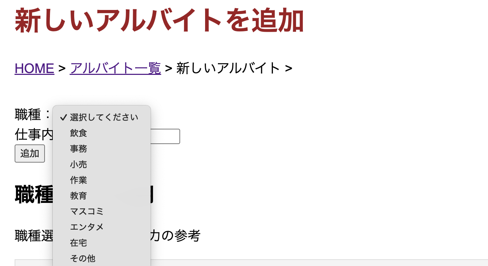

# アプリ名: oop2_10_CampasJob（愛知工業大学大学生バイト管理システム）
> アプリ名は、プロジェクトの顔でもあるので、適切な命名を行ってください。

概要:
> 概要には、このアプリで何ができるのかを簡潔に書きましょう。
1. ユーザー情報の管理ができる  
学籍番号、性別、学年、学科など、大学生の基本プロフィールを登録できる  
登録したユーザーの一覧を表示できる  
後から編集・削除も可能（仕様に入れるなら）
   
2. アルバイト情報の管理ができる  
コンビニ、飲食店、塾講師などの**職種（occupation）**を登録できる  
また、仕事内容（work description）も追加できる  
職種一覧から探せるようになる
  
3. ユーザーとバイトの紐付け（レジストレーション）ができる  
誰がどのアルバイトをしているかを登録できる  
時給（wage）を入力し、「ユーザー × バイト × 時給」 の関係を1つのテーブルとして保存できる
登録済みの紐付け一覧を表示して、可視化できる
  
4. 学生バイト状況の把握ができる  
「一番時給が高いバイトは？」  
「どの仕事が人気か？」  
などを見やすく確認できる  


## アピールポイント

この部分に、発表に替わる内容を書きます。
アプリケーション動作のサンプル動画などを貼り付けられると良いです。
※動画の貼り付けは、GIFアニメーションなどでも可です。

* アルバイト追加画面で職種を選択できる機能を実装
職種を選択式にすることで、登録されたアルバイト情報を職種ごとに整理しやすくし、後続のグラフ化や分析が行いやすい設計とした。

* 


* 職種と主な仕事内容の例を一覧表で表示
利用者が各アルバイトの職種を正しく理解した上で登録できるよう、職種と仕事内容の例を一覧で確認できるように工夫した。
* <!-- スクリーンショット / 動画 -->


* 時給グラフの視認性向上の工夫
最も人数の多い時給帯の目盛りを赤色で強調表示し、分布の特徴が一目で分かるようにした。
<!-- スクリーンショット / 動画 -->


* 学年ごとの色分けによる比較分析
学年ごとに色分けを行うことで、時給と学年の関係を視覚的に比較・分析しやすくした。
<!-- スクリーンショット / 動画 -->


* 未入力項目のチェックによる入力漏れ防止
未入力の項目がある場合はデータを追加できないように制御し、登録時の入力漏れを防止している。
<!-- スクリーンショット / 動画 -->


* 時給入力値のバリデーションを実装
時給に負の数を入力できないよう制御し、下限を岐阜県の最低賃金である1065円に設定した。上限については法律上の規定がないため、制限を設けていない。
<!-- スクリーンショット / 動画 -->


* 削除機能における安全設計
既に使用されているアルバイト先は削除できないように制御し、データ不整合などのエラーを事前に防止している。
<!-- スクリーンショット / 動画 -->


* 削除時の警告表示による誤操作防止
削除ボタン押下時に警告文を表示し、利用者に再確認を促すことで、誤操作による削除を防ぐ工夫を行った。
* アルバイト先の使用状況を可視化
使用中のアルバイト先については、何件のデータで使用されているかを表示し、現在の利用状況が分かるようにした。
<!-- スクリーンショット / 動画 -->


## 動作条件: require

> 動作に必要な条件を書いてください。

```bash
python 3.13.7

# python lib
Flask==3.1.2
peewee==3.18.3

# frontend lib (CDN)
Chart.js
```

## 使い方: usage
　> このリポジトリのアプリを動作させるために行う手順を詳細に書いてください。

```bash
$ python app.py
# Try accessing "http://localhost:8080" in your browser.
```
　　
　　
　　


## バイトアプリの仕様    
・ユーザーuser    
学籍番号（学科）student_id  
性別gender  
学年grade    
  
・アルバイトjob  
職種occupation    
仕事内容work_detail  

・登録registration   
ユーザー（選択）user_id    
アルバイト（選択）job_id    
時給（入力）hourly_wage      


## 役割  
リーダー :k24135  丸山優梨    yuuri-mr  
  

:k24017  伊藤源太     tanukiponta-creator  
:k24031  海老原巧翔   ebiharaaa0909  
:K24071 佐々木 知哉    to-sasaki333
  
:K24084   鷲見叶芽    KanameSumi  
